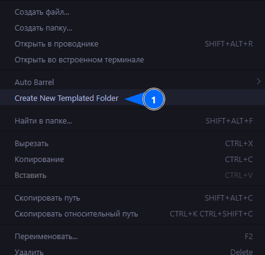
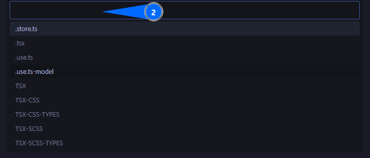
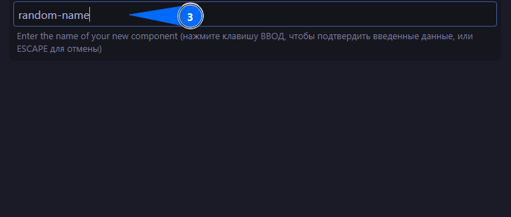

# Folder Templates

Готовые шаблоны для расширения VS Code [Folder Templates](https://github.com/Huuums/vscode-folder-templates). Берите любой нужный шаблон из папки `.fttemplates/` и редактируйте под свой проект.

## Доступные шаблоны

| Шаблон           | Что создаёт                                           |
| ---------------- | ----------------------------------------------------- |
| `TSX`            | Компонент: `index.ts` + `ui/[Name].tsx`               |
| `TSX-CSS`        | Компонент: `index.ts` + `ui/[Name].tsx` + CSS-модуль  |
| `TSX-CSS-TYPES`  | Компонент с CSS-модулем + `model/` (типы)             |
| `TSX-SCSS`       | Компонент: `index.ts` + `ui/[Name].tsx` + SCSS-модуль |
| `TSX-SCSS-TYPES` | Компонент с SCSS-модулем + `model/` (типы)            |
| `.tsx`           | Одиночный `.tsx`-файл                                 |
| `.store.ts`      | Zustand-стор                                          |
| `.use.ts`        | Хук `use[Name]`                                       |
| `.use.ts-model`  | Хук с папкой `model/`                                 |

## Как использовать

### Шаг 1 — Вызвать меню создания

Нажмите **ПКМ** по папке, в которой хотите создать файлы, и выберите **Create New Templated Folder**.



### Шаг 2 — Выбрать шаблон

Выберите нужный шаблон из выпадающего списка.



### Шаг 3 — Ввести название

Введите одно название — оно подставится в имя папки и всех файлов внутри. Рекомендуется использовать **kebab-case**.



> Расширение автоматически преобразует имя в нужный регистр (`PascalCase`, `camelCase` и т.д.) там, где это необходимо.

## Дополнительно

Чтобы редактор (VS Code), линтер и TypeScript не выдавали ошибок синтаксиса из-за плейсхолдеров шаблонизатора (например, `[FTName | pascalcase]`), добавьте в настройки проекта `.vscode/settings.json` ассоциацию файлов:

```json
{
  "files.associations": {
    "**/.fttemplates/**": "plaintext"
  }
}
```

На данный момент это единственный надежный способ избежать ложных ошибок синтаксиса в файлах шаблонов.

### Рекомендация по созданию новых шаблонов

Так как файлы с ассоциацией `plaintext` лишены подсветки кода и автодополнения, создавать новые шаблоны непосредственно в папке `.fttemplates` неудобно.

**Рекомендуемый рабочий процесс:**

1. Создайте нужный файл (например, компонент `.tsx` или хук `.ts`) в обычном месте вашего проекта вне папки `.fttemplates`.
2. Напишите код с использованием привычного форматирования, автоимпортов и автодополнения.
3. Перенесите готовый файл в папку `.fttemplates`.
4. Переименуйте файл, добавив конструкцию `[FTName % ...]`, и замените нужные части кода внутри файла на плейсхолдеры вроде `[FTName | pascalcase]`.

## Создание собственных шаблонов

Подробная документация по синтаксису и созданию шаблонов — в официальном репозитории расширения:
[github.com/Huuums/vscode-folder-templates](https://github.com/Huuums/vscode-folder-templates)
